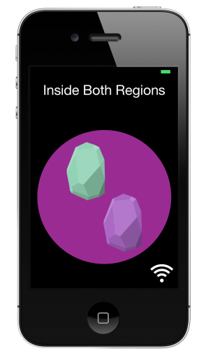
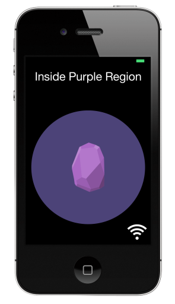

Region Monitoring (in Swift)
=====================

iBeacon region monitoring, in Swift. The app uses two regions, defined by hardcoded iBeacons (purple and green estimote, respectively). The app recognizes the location as being in neither of these regions, either of them or both. It also sends local notifications on entering a region.

## Design

The app centers around a singleton BeaconManager class, which tells the app about beacons that have been discovered. This is more or less copied from my triangulation app (https://https://github.com/a34729t/TriangulatorSwift) with the addition or region entry/exit delegate methods. And of course, background mode is enabled, and the background capabilties are enabled (detects BLE accessories, and location updates). Local notificiation and bading is handled in Utils.swift and AppDelegate.swift.

## Testing

This works on an iPhone 4S running iOS 7.1, with Estimote iBeacons.

## CoreLocation vs CoreBluetooth

I am using CoreLocation, which is the only accepted way of interating with iBeacons. CoreBluetooth doesn't give you the background capabilities needed in a distance-aware app.

CoreLocation gives you iBeacon class (proximity UUID), major and minor (think of them as ways to give an iBeacon a unique ID). CoreBluetooth gives you only a deviceUUID. In fact, the information available to CoreLocation and CoreBluetooth is  mutually exclusive- they handle the iBeacon advertisements differently.

## Shamelessly Stolen Artwork

* Estimote iBeacons: From http://www.uidesignbyadam.com/blog/

## Credits

* People who's artwork I stole (see above)
* Me
